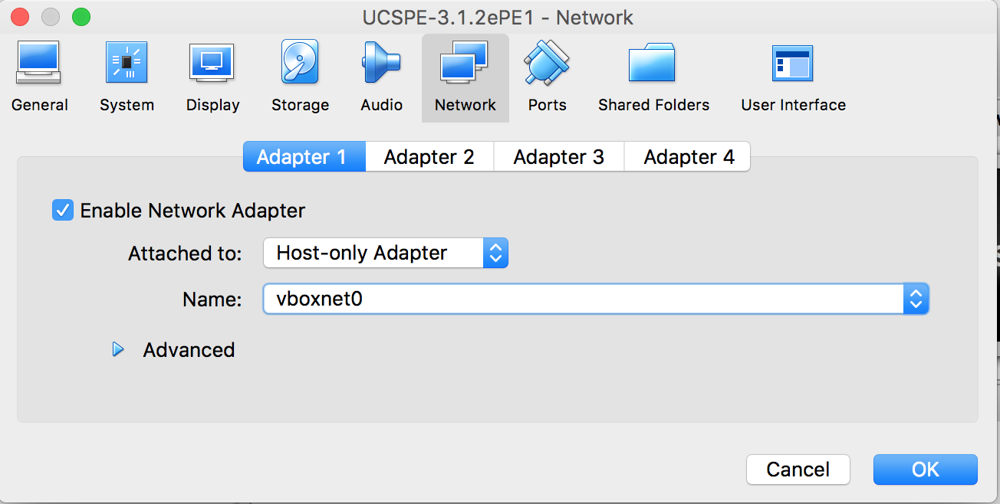

# Finalizing the UCS Platform Emulator
After importing the OVA but prior to booting the emulator, you must configure the
three network adapters on the VM to connect to a network that provides DHCP 
addresses.

In VirtualBox, you'll have to create a Host Network first via the "Host Network Manager".
On a Mac, the manager is found in the File menu:

In the manager, click the "Create" button to create a new host network.  Ensure the IP 
network does not overlap the 192.168.254.0/24 network as that will cause conflicts with
the IP Management pool created by the Ansible playbook in this demo.

Close the Host Network Manager and edit the UCSPE VM settings.  Under the Network 
settings of the VM, for Adapters 1-3, change the "Attached To" setting to 
"Host-only Adapter" and ensure the "Name" setting matches the host network you created.

Now, the UCS Platform Emulator is ready to boot.

Once booted, load the core policy configuration from the XML in the ''ucspe'' 
directory

